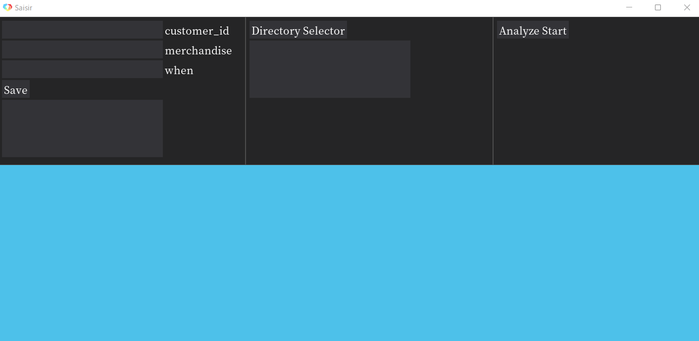

アプリケーションを開く
=====================

zipフォルダの解凍
----------------

まずはダウンロードしたzipフォルダを解凍しましょう。

解凍したフォルダはデスクトップなど、開きやすい場所などに移動させてください。

解凍したフォルダの中身は以下のようになっています。

    - NotoSerifCJKjp-Medium.otf : 日本語のフォントを表示するためのファイル
    - Saisir_(バージョン).exe : メインとなるアプリケーション実行ファイル
    - logo.ico : Saisirのロゴファイル

exeファイルの起動
----------------

ファイルの確認が完了したらexeファイルを開いてください。

.. note::

    | この際、ウイルスバスターなどが反応することがあります。
    | 少し待つと実行できるようになります。
    | ならない場合は `こちら`_ からご報告ください。

.. _こちら: https://forms.gle/u9JehhSYTS1XSvJLA

以下のような画像が表示されればアプリケーションの起動は完了となります。

