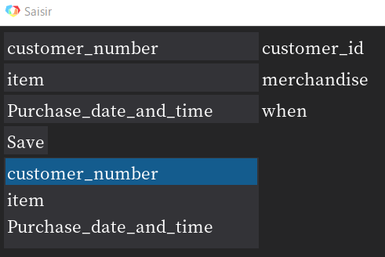

情報の入力
=========

3つの入力欄
---------

画面左上にある3つの入力欄はそれぞれ

=========== ========================
入力名       意味
=========== ========================
customer_id 分析するデータの顧客ID名
merchandise 分析するデータの商品列名(商品IDでもよいが結果もIDとなる)
when        購買日時列名
=========== ========================

を表しています。

これら3つの名前を分析したいデータから抽出し、入力後 **Save** を押してください。

すると、その下に入力情報が保存されます。

例：

このように情報が保存されたことを確認したら次へ進んでください。

間違って保存した場合は、新たに入力し直して再度 **Save** を押していただけると情報が更新されます。
